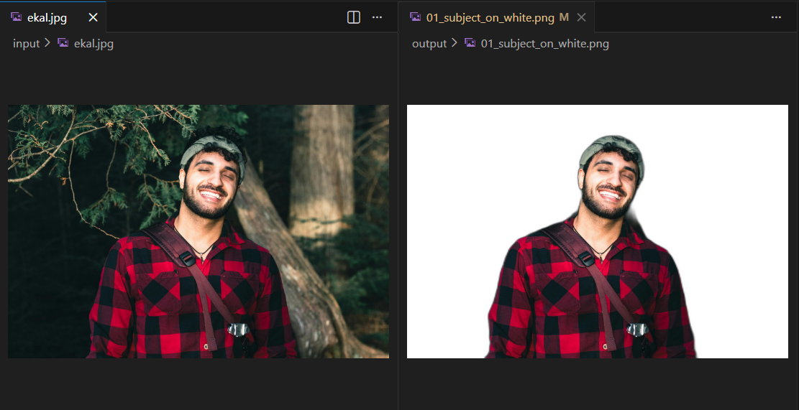
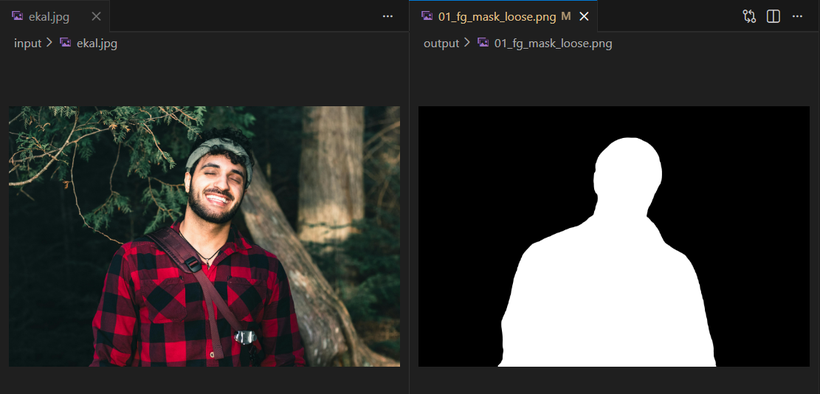
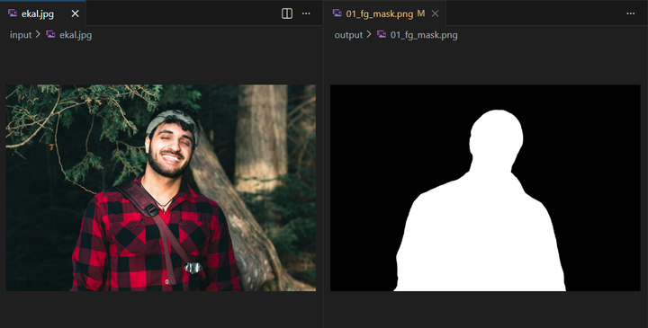
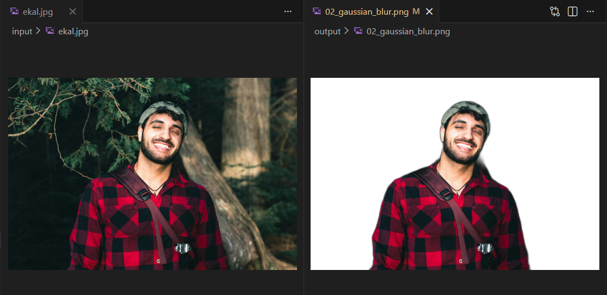
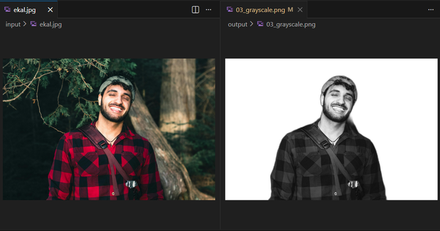
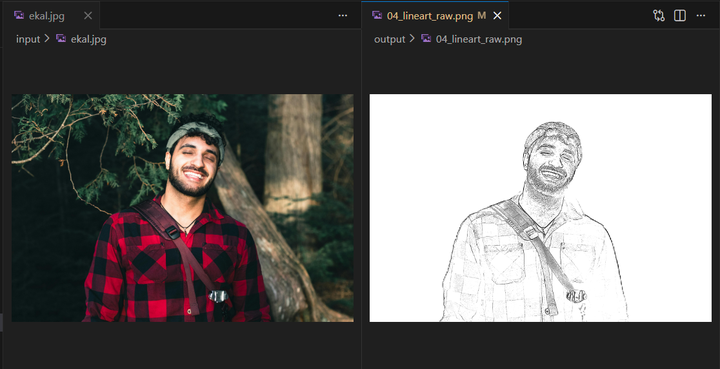

### Project Title: Automated Image Processing Pipeline

Automated Image Processing using DevOps CI Pipeline

## Requirements!!
Python 3 | OpenCV | GitHub Actions | PyTest 

## 📝 Project Overview
The Automated Image Processing Pipeline is a Python-based computer vision system that applies a sequence of OpenCV image processing techniques to extract clean object outlines from images.

The pipeline removes background noise, smooths image textures, converts images into grayscale, detects edges, and refines contours using morphological operations. These steps work together to transform raw images into simplified structural representations suitable for visualization or further analysis.

The system demonstrates how multiple image-processing filters can be combined into a single automated workflow.

## 🖼️ OpenCV Function Reference
The following OpenCV functions were used in this milestone:

1. Pre-Processing (Cleaning the Data)

cv2.cvtColor(): The first step in the pipeline. It converts the raw BGR image to Grayscale to reduce data complexity.

cv2.GaussianBlur(): Used to reduce pixel noise by averaging pixel values with a Gaussian kernel.

cv2.bilateralFilter(): A more advanced smoothing technique used to remove noise while keeping the edges sharp.

2. Segmentation & Edge Detection (Finding Shapes)

cv2.Canny(): The primary edge detection algorithm used to find the outlines of objects based on intensity gradients.

cv2.threshold(): Converts a grayscale image into a Binary (Black and White) image, effectively separating the "object" from the "background."

3. Morphological Operations (Refining the Outline)

cv2.getStructuringElement(): Defines the "shape" (kernel) used for morphological math.

cv2.morphologyEx(): Performs advanced operations like "Closing" or "Opening" to remove tiny holes inside the detected objects.

cv2.dilate(): Expands the white pixels in a binary image to make thin outlines thicker and more visible.

4. Image Logic & Composition

cv2.bitwise_and(): A bitwise operation used to apply a "mask" to an image (e.g., showing only the part of the image inside a detected shape).

cv2.addWeighted(): Blends two images together (often used to overlay detected edges back onto the original photo for visualization).

## ▶️ How to Run Locally 
Follow these steps to run the project on your computer:
1. **Clone the Repository:** 
```bash
git clone https://github.com/flyingcookere/elec4-image-processor.git
```
2. **Navigate into the project folder**
```bash
cd elec4-image-processor
```
4. **Set up a Virtual Environment**
```bash
python -m venv venv
.\venv\Scripts\activate
```
6. **Install dependencies**
```bash
pip install -r requirements.txt
```
8. **Run the image processing script**
```bash
python src/main.py
```
10. **Execute Automated Tests Verify the logic using the team's Shared Tools.**
```bash
pytest -vv -s
```


### 📊 Status & Traceability Matrix

| ID | System Requirement | Status | Milestone Link | Exact Pull Request |
| :--- | :--- | :--- | :--- | :--- |
| **REQ-01** | Auto-detect images in input directory | ✅ DONE | [https://github.com/flyingcookere/elec4-image-processor/milestone/2](| [https://github.com/flyingcookere/elec4-image-processor/issues/6] |
| **REQ-02** | Apply 2+ OpenCV techniques | ✅ DONE | [https://github.com/flyingcookere/elec4-image-processor/milestone/3] | [https://github.com/flyingcookere/elec4-image-processor/issues/13 , https://github.com/flyingcookere/elec4-image-processor/issues/14] |
| **REQ-03** | Save to output directory | ✅ DONE | [https://github.com/flyingcookere/elec4-image-processor/milestone/4] | https://github.com/flyingcookere/elec4-image-processor/issues/30 |
| **REQ-04** | GitHub Actions Pipeline (Run on Push) | ✅ DONE | [https://github.com/flyingcookere/elec4-image-processor/milestone/1] | [https://github.com/flyingcookere/elec4-image-processor/issues/3] |

## ✨ Key Features

* **Automated Detection**: Script scans for supported image formats (JPG, PNG) in `/input`.
* **OpenCV Suite**: High-performance transformations including Grayscale and Edge Detection.
* **Validation Layer**: Integrated **PyTest** suite for logic verification.
* **Infrastructure as Code**: **Docker** support for platform-independent execution.

### 📸 Visual Gallery & Verification


| Step | Transformation Technique | Source Code Reference | Visual Proof |
| :--- | :--- | :--- | :--- |
| **01** | **Background Removal** | `src/filter_01_bg_removal.py` |  |
| **01a** | **Mask (Loose)** | `src/filter_01_bg_removal.py` |  |
| **01b** | **Mask (Refined)** | `src/filter_01_bg_removal.py` |  |
| **02** | **Gaussian Blur** | `src/filter_02_gaussian_blur.py` |  |
| **03** | **Grayscale Conversion** | `src/filter_03_grayscale.py` |  |
| **04** | **Canny Edge Detection** | `src/filter_04_edge_detect.py` |  |
| **05** | **Morphological Closing** | `src/filter_05_morphology.py` |  |


### ⚙️ DevOps & Observability Workflow 
**Configuration Path:** [`.github/workflows/ci.yml`](.github/workflows/ci.yml)

The project implements a comprehensive *CI* (Continuous Integration) pipeline to ensure systemic reliability and shared visibility across the entire software lifecycle. This automation acts as a neutral middleman, ensuring that every code change is validated before being archived for release.

* **Continuous Integration (CI)**
  * **Linting**: Automatically executes Flake8 to enforce coding standards and catch syntax errors (E9, F63, F7, F82) before the build starts.
  * **Logic Validation**: Runs the Pytest suite to verify OpenCV filter accuracy and image handling logic across test cases.
* **Continuous Delivery & Release (CD)**
  * **Operate**: Automatically initializes the output/ directory structure and logs start times to ensure a consistent workspace for every run.
  * **Automated Artifact Packaging**: Upon successful testing, the pipeline archives the processing results and the HTML Test Report as a "Quality-Package-Run," making them available for immediate download.
* **Continuous Feedback & Monitoring**
  * **Shared Visibility**: Integrates Advanced PR Comments that link directly to build artifacts, allowing stakeholders to see real-time results without leaving the GitHub interface.
  * **Traceability**: Every build is tagged with a unique run number, ensuring that every result in the output/ gallery can be traced back to the specific code version that generated it.
 

## 📈 Process Evolution (Workflow & Documentation) 
**Strategy**: Industry-Standard SDLC

We implemented advanced Industry Workflows to maintain high velocity without sacrificing code quality. Our process is built on a "Shared Responsibility" foundation, ensuring every line of code is verified by the team before reaching the production state.

### 📋 Project Management & Traceability
* **No Issue, No Work Policy**: Development is strictly demand-driven. No code is authored or merged unless it addresses a pre-existing, documented Issue in GitHub or Jira.
* **Mandatory PR Linking**: Every Pull Request must be linked to specific Issues to create a permanent audit trail. This ensures Shared Visibility for all stakeholders.
* **Granular Organization**:
  * **Tags & Labels**: Issues utilize a multi-tag system (e.g., critical, feature, documentation) for efficient filtering and priority management.
  * **Clear Ownership**: Every Issue is assigned to a specific collaborator, ensuring clear accountability for every project component.
* **Automated Progress Tracking**: By leveraging GitHub Projects, version history and progress tracking are automated. This serves as the "Single Source of Truth" for the team to view real-time status without manual reporting.

### 🖊️ Governance & Standardization
* **Standardized Formatting**:
  * **Commit Messages**: We follow a strict prefix-based convention to maintain a professional and readable Git history.
  * **PR Titles**: Titles follow standardized naming conventions to facilitate easy auditing during release cycles.
* **The Contributor's Guide**: A documentation resource was established to onboard collaborators and enforce standards regarding branching strategies and coding styles.
* **Visual Proof of Work**: All PR descriptions are required to include screenshots or terminal logs (e.g., pytest output) as evidence of local verification.

### 🛡️ Quality & Gatekeeper Protocols
* **Gatekeeper Protocol**: A strict **No Direct Push** policy is enforced on the main branch to protect production-ready code. This is enforced via GitHub branch protection and the [**CODEOWNERS**] file.
* **Automated Logic Validation**: Our GitHub Actions CI suite serves as an automated gatekeeper, running flake8 and pytest checks on every push. Merges are blocked unless all status checks pass.
* **Zero Documentation Debt**: We maintain **Living Documentation** within the repository to ensure the README accurately reflects the exact state of the project board at all times.

### 📂 Governance Resources
| File / Resource | Location | Purpose | 
| :--- | :--- | :--- |
| **CODEOWNERS** | [`./.github/CODEOWNERS`](./.github/CODEOWNERS) | Automated assignment of code testers and reviewers for src/. | 
| **CI Workflow** | [`.github/workflows/ci.yml`](./.github/workflows/ci.yml) | Automated gatekeeper for linting and logic validation. | 
| **Project Board** | [GitHub Projects](https://github.com/users/flyingcookere/projects/2/views/1) | Automated tracking of milestones, tags, and assignees. |


### 🖼️ Image Processing Lead 

## 📥 Ingestion (Scanning the /input Directory)**

The image processing pipeline begins by scanning the /input directory for newly added image files. Once a stable image file is detected, it is loaded into the system using OpenCV. At this stage, no image enhancement or transformation is applied, as the primary objective is only to acquire the raw image data for processing.
We used cv2.imread() to read the input image file and convert it into a matrix representation that can be processed by succeeding OpenCV functions.

## 🎛️ Initial Transformation (Gaussian Blur and Grayscale Conversion)**

After ingestion, the image undergoes initial transformation to prepare it for edge detection.
To reduce noise and small texture details that may interfere with edge extraction, we used cv2.GaussianBlur() to smooth the image. This step minimizes high-frequency noise while preserving the overall structure of the subject.
After noise reduction, the smoothed image is converted into grayscale using cv2.cvtColor() with the cv2.COLOR_BGR2GRAY flag. This conversion reduces the image to a single intensity channel, which is required for reliable edge detection since edges are based on changes in pixel intensity rather than color.

## 🧠 Image Processing Logic

# ✂️ Canny Edge Detection (Edge Identification)

To identify edges and object boundaries in the image, we used cv2.Canny(). This function detects edges by analyzing intensity gradients and locating areas with significant brightness changes.
The Canny algorithm internally applies non-maximum suppression to thin the edges and uses a dual-threshold hysteresis process to classify strong and weak edges. Strong edges are retained, while weak edges are preserved only if they are connected to strong edges. This approach allows meaningful contours to be detected while suppressing isolated noise.

# 🧩 Morphological Closing (Boundary Refinement)

The edge map produced by the Canny detector may contain broken lines and small gaps. To refine these boundaries, we applied morphological closing.
We used cv2.getStructuringElement() to define the shape and size of the morphological kernel. Using this kernel, we applied dilation with cv2.dilate() to connect broken edge segments, followed by erosion with cv2.erode() to restore proper line thickness.
This sequence effectively performs morphological closing, which improves boundary continuity and produces smoother, more coherent outlines suitable for the final output.


# 📁 Image Processing Files Overview 
**📦 Filter Modules** 

| File Name                        | Purpose                  | Description |
|----------------------------------|--------------------------|-------------|
| `src/main.py`                    | Pipeline Orchestration   | Acts as the main controller of the system. Scans the `/input` directory, validates file stability, executes each image processing stage in sequence, and handles output saving and fallback logic. |
| `src/filter_01_bg_removal.py`  | Background Removal       | Uses an AI-based segmentation model (U²-Net) to isolate the subject from the background. Outputs a subject-on-white image and a binary foreground mask for later processing. |
| `src/filter_02_gaussian_blur.py` | Noise Reduction          | Applies Gaussian Blur to reduce texture noise and minor intensity variations that may interfere with edge detection. |
| `src/filter_03_grayscale.py`    | Intensity Simplification | Converts the blurred color image into a single-channel grayscale image to simplify edge detection based on intensity changes. |
| `src/filter_04_edge_detect.py`   | Edge / Line Extraction   | Extracts dominant contours and outlines from the grayscale image. Uses the foreground mask to suppress background artifacts and produce clean line art. |
| `src/filter_05_morphology.py`    | Boundary Refinement      | Refines raw edges using morphological operations. Removes small noise components, reconnects broken lines, thickens strokes, and smooths contours for final output quality. |

The image processing engine is implemented using OpenCV (cv2) with AI-assisted background segmentation.
The pipeline follows a deterministic, stage-based flow.

<br>

## 📥 Ingestion

src/main.py runs in an automated hot-folder mode that scans /input for valid image files.

Detects supported file types

Verifies file stability before processing

Loads images using cv2.imread()

Implementation: watch_and_process(), is_file_stable()

<br>

**🧍 Background Removal**

The subject is isolated using an AI-based background remover (U²-Net) to prevent unwanted background edges.

Outputs subject-on-white image and foreground mask

Mask is dilated using cv2.dilate() to preserve fine details

File: filter_01_bg_removal.py

<br>

## 🎛️ Pre-Edge Conditioning

Gaussian Blur: Noise reduction using cv2.GaussianBlur()

Grayscale: Intensity simplification using cv2.cvtColor(..., COLOR_BGR2GRAY)

Files:
filter_02_gaussian_blur.py, filter_03_grayscale.py

<br>

## ✂️ Edge Detection

Contours are extracted from the grayscale image, with background suppression using the foreground mask.

File: filter_04_edge_detect.py
Output: 04_lineart_raw.png

<br>

## 🧩 Morphological Refinement

Edges are cleaned and thickened for visual clarity.

Noise removal

Line reconnection and smoothing

OpenCV Ops: connectedComponentsWithStats(), dilate(), medianBlur()
File: filter_05_morphology.py
Final Output: 05_coloring_book.png

<br>

## 💾 Export & Safety

All outputs are saved using cv2.imwrite().
A fallback mechanism guarantees final output generation.

Implementation: process_one_image()


## 🧪 Quality Assurance (Automated Testing)

**Test Directory:** `tests/`  
**Documenter Source:** `PyTest` terminal logs and GitHub Actions history

The system ensures reliability through `PyTest`. Automated tests verify the full lifecycle of an image from the `input/` folder to the final `output/` directory, ensuring no data is lost or corrupted during the transformation.

### 📡 Detection & I/O Success
* **File Discovery:** Automatically verifies the correct identification and staging of image files from `tests/assets/` into the `input/` folder for processing.
* **Subprocess Execution:** Confirms the system’s ability to execute `src/main.py` successfully, capturing `stdout` and `stderr` to ensure no runtime crashes occur.
* **Directory Management:** Automatically creates and cleans up image-specific subdirectories within the `output/` folder after each test run to maintain repository hygiene.
* **File location:** `tests/test_processor.py`

### 🔍 Filter Logic Validation
* **Grayscale Gate:** Mathematically confirms that the grayscale filter produces a single-channel look by verifying that Blue, Green, and Red channels are identical ($B=G=R$).
* **Blur Verification:** Uses **Laplacian variance** to calculate image sharpness, ensuring the Gaussian blur filter successfully reduces high-frequency detail compared to the original.
* **Background Removal:** Samples a 10x10 pixel patch in the corners to ensure a pure white background (>235 mean intensity) and checks standard deviation to ensure the subject exists.
* **File location:** `tests/test_processor.py`


### 🖋️ Line Art & Integrity
* **Edge Density Check:** Analyzes `04_lineart_raw.png` to ensure the white-to-black ratio falls between 30% and 99%, preventing noisy or over-saturated outlines.
* **Contrast & Binarization:** Measures the "gray ratio" in the final coloring book output; tests fail if more than 25% of pixels are mid-tones, ensuring a high-contrast result.
* **Connectivity Analysis:** Uses `connectedComponentsWithStats` to analyze the "ink" mask, verifying that lines are continuous and meet a minimum average segment size (>3px).
* **File location:** `tests/test_processor.py`

### 🚀 Resilience Testing
* **Corruption Gate:** Utilizes `cv2.imread()` validation to ensure processed files are readable and not corrupted during the "Rotify" execution pipeline.
* **Time-Out Protection:** Executes a "Stress-Test" with a 180-second timeout to ensure the OpenCV compute engine remains stable and does not hang on complex images.

Prerequisites
Python Version: 3.10+
